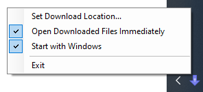

# TeamsDownloadWatcher
Watches Microsoft Teams for downloaded files, then moves and/or opens them. Teams has so far failed to provide the ability to specify the location to download files to, or the ability to just open a file rather than downloading it. This project is a dirty little workaround to get this behaviour.

# Installation
Download TeamsDownloadWatcher.exe from the [releases](releases) page, put it somewhere and run it. .NET Framework 4.7.2 is required, but this should already have been installed by Teams. TeamsDownloadWatcher.exe must remain running for it to work; check "Start with Windows" on the context menu for the icon in the notification area to have it start with Windows.

# Usage
To have files downloaded from Teams go in a specific folder, use "Set Download Location..." from the context menu. This can, for example, be your temporary files folder.

To have files downloaded from Teams open automatically with their associated application, use "Open Downloaded Files Immediately" from the context menu.

# Uninstallation
Uncheck "Start with Windows" if you have it checked. Exit the application using "Exit" from the context menu. Delete TeamsDownloadWatcher.exe. Configuration data can be deleted from `%LOCALAPPDATA%\TeamsDownloadWatcher`.

# How it works
Teams downloads files into the default Downloads folder, using a guid.tmp naming scheme, then renames the file to its proper name. This application watches for that happening, then grabs the file and moves it to where it ought to go, and opens it with the shell.
